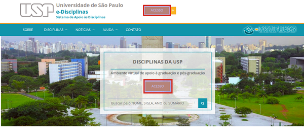
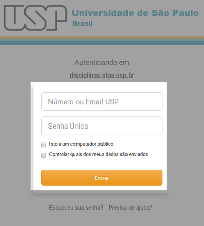
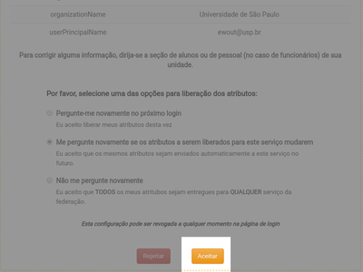

Cadastros
=========

.. contents:: Conteúdo

----------------------

Cadastro, nome de usuário e senha: como entrar no sistema
---------------------------------------------------------

Não é preciso criar uma nova conta para entrar no Moodle da USP: basta usar a Senha Única da USP. É a senha dos Sistemas da USP e o email da USP. Para entrar no Moodle da USP, basta agora clicar no botão "Senha USP" e dar seu número USP e Senha Única. 

Para criar a Senha Única da USP,

    1. Entre em https://id.usp.br/,
    2. Clique em Primeiro acesso,
    3. Preencha seu número USP e seu e-mail pessoal (e-mail alternativo), aquele **informado no momento da inscrição para a Fuvest/SISU**. 

Se não tiver acesso mais ao seu e-mail alternativo ou se está cadastrado errado, deverá entrar em contato com sua Seção de Alunos (ou Seção de Pessoal, no caso de docentes e funcionários). 

Assista as `instruções completas no Youtube`_ (estas mesmas instruções valem para acessar seu e-mail da USP).

Veja mais informações sobre a Senha Única abaixo ou `acesse este post`_.

Usar Senha USP / Senha Única
----------------------------

A Senha Única ou Senha USP é uma iniciativa da USP de unificar a autenticação para a Comunidade USP, tanto para entrar nos Sistemas da própria USP, como para entrar nos Sistemas acadêmicos fora da USP.

Para entrar no Moodle da USP, procure na página principal o link Senha USP (veja na imagem acima).

Será encaminhado para um formulário de login: 

Será encaminhado de volta para o Moodle da USP imediatamente,

Atenção, a primeira vez em que se loga desta forma, verá quais dados dos sistemas da USP são compartilhados com o Moodle. Procure o botão "Aceitar" e clique nele 

Problemas com sua Senha Única / Senha USP?
------------------------------------------

Se usar Marteweb, Janus, Eduroam ou outros serviços da USP que já usam a senha única, não terá problema se logar usando a Senha Única da USP. Porém, é sabido que para a maioria dos usuários do Júpiter (infelizmente) não há certeza que a sua senha seja igual à Senha Única. Para uma fração razoável dos alunos, será necessário recuperar ou criar a Senha Única. Veja como: 

**Primeiro, tente recuperar Senha Única**
    No `Portal da Senha Única`_. Lá também se pode criar uma Senha Única da USP pela primeira vez.
**Segundo, caso precisa de mais ajuda**
    Entre em contato com a sua Seção de Alunos ou Seção de Pessoal da sua Unidade. Eles irão cadastrar um e-mail pessoal (não @usp.br) com o qual será possível criar uma Senha Única. 

 
.. _`instruções completas no Youtube`: https://www.youtube.com/watch?v=KP5NWyk2OOo
.. _`acesse este post`: https://atp.usp.br/moodle/senha-unica-da-usp/
.. _`Portal da Senha Única`: https://id.usp.br/
