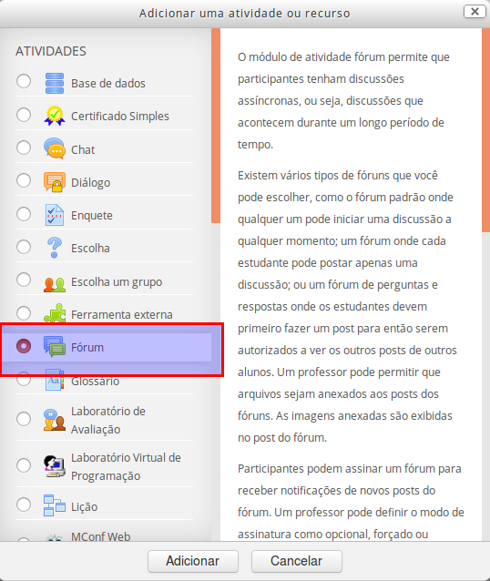
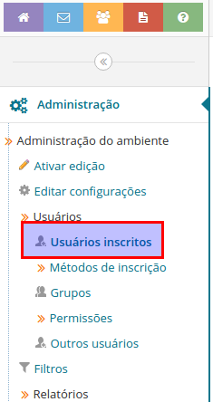
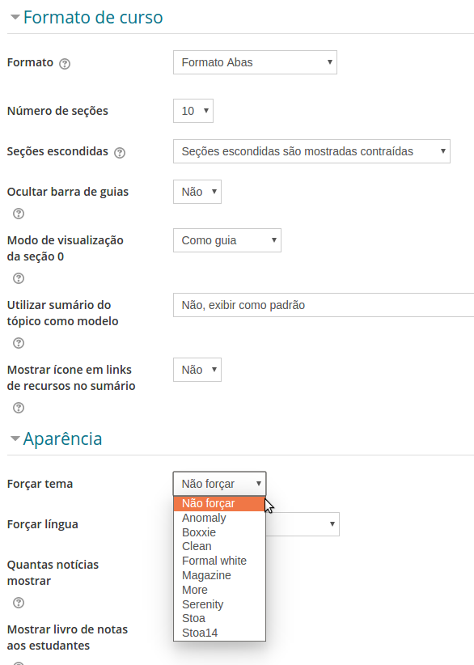

Dicas
=====

.. contents:: Conteúdo

Material de Referência
----------------------

* A `documentação oficial`_ do Moodle, para ministrantes, administradores, etc. Para docentes e monitores recomendamos o `FAQ`_ e a página "`Managing a Moodle course`_"
* Uma série de vídeos curtos para docentes e monitores (em inglês): `Learn Moodle 3.5`_
* Existem `vários tutoriais interessantes`_ na rede.
* Uma `playlist de vídeos curtos`_ especialmente feito para a plataforma e-Disciplinas.

O Menu do Usuário
-----------------

Menu do Usuário no Moodle

No menu do usuário, podemos ter acesso a várias informações e
configurações da sua conta no sistema. Acesse o menu clicando no seu
nome em amarelo, no canto superior direito da tela.

Modificar seu Perfil
--------------------

	
	Menu do Usuário no Moodle

Para mudar configurações, como o seu nome, no sistema:

    * Abre o menu do usuário e clique em "Perfil" para ver seu perfil ou escolha "Modificar perfil" para editar. 

Em "Modificar perfil" você também pode configurar quem pode ver seu e-mail, subir um ícone, avatar (uma foto de perfil) ou preencher um texto que descreva um pouco sobre vocẽ (no campo Descrição").

**Atenção**: Não é possível mudar seu e-mail, pois este é sincronizado com o e-mail cadastrado nos sistemas da USP (este e-mail pode somente ser mudado pela Seção de Alunos ou de Seção de Pessoal). Se precisar mudar o e-mail para o qual o sistema vai enviar as notificações, veja a próxima seção.

Gerenciar notificações
----------------------
O Moodle manda notificações sobre eventos relevantes, como novos posts em fóruns ou prazos próximos a vencer. As notificações são enviadas no seu e-mail configurado (veja abaixo) ou para seu celular (se o app estiver instalado). No topo de cada página, há um atalho que dá acesso às notificações e ao caminho para configurá-las: 

Para gerenciar todas as configurações de notificações, clique no ícone da engrenagem. Também é possível abrir o Menu do Usuário do Moodle e clicar em "Configurar notificações": 

.. image:: ../_images/Configurar-notificacoes-2.png
	:align: center
	:scale: 65

Note que pode pode desabilitar completamente todas as notificações (não recomendado) ou escolher por atividade caso queira ou não recebê-las. Apesar de não poder mudar seu e-mail principal (veja acima), você pode mudar o e-mail para o qual o Moodle manda notificações: clique em "E-mail" e um Pop-Up abrirá. 

Gerenciar notificações de fóruns
--------------------------------
Quando estiver "assinando" um fórum, você receberá uma cópia de cada post novo. Se o modo de assinatura do fórum permitir (configurável pelo responsável ou monitor do ambiente), é possível gerenciar o recebimento destas notificações, do fórum inteiro ("suspender o recebimento...") , ou por tópico ("Desinscrever da discussão"). Clique em "Alterar suas opções de resumo" para configurar todos os fóruns da disciplina. 

**Importante: é necessário estar logado no sistema antes de clicar nos links!**

Docentes e monitores: entrar no Modo "Edição"
---------------------------------------------
Antes de colocar qualquer recurso ou acrescentar atividades no seu curso, é preciso "Ativar a edição": clicando em "Configurações" > "Administração do ambiente", clique em "Ativar edição". Alternativamente, há um botão "Ativar edição" no lado topo direito, logo abaixo do menu principal.

Se no seu ambiente de apoio o menu "Administração" não aparece como ao lado, ou se o o botão "Ativar edição" não aparecer, provavelmente você não está no "Papel" de docente ou monitor e não possui permissões suficientes para editar este ambiente. 

Mudar as Configurações do ambiente
----------------------------------
Localize o menu "Administração" (na barra lateral esquerda) e clique em "Administração do ambiente" > "Editar configurações"

Como disponibilizar arquivos
----------------------------
    1. Ative a edição e acrescente um "Recurso" do tipo "Arquivo" a um tópico ou semana.
    2. Com edição ativada, arraste com o mouse um arquivo do seu computador para a seção do seu ambiente onde quer disponibilizar o arquivo.
    3. Em qualquer lugar onde aparecer o Editor do Moodle, selecione uma palavra ou frase que escreveu, procure o ícone de cadeia, clique em "Navegar nos repositórios" e siga as instruções para subir um arquivo.
    4. Se o arquivo for multimídia (mp3, mp4), prefira o ícone de "filme" no Editor do Moodle. Use o ícone de paisagem para inserir imagens. 

Dicas:

    1. Se quiser subir vários arquivos tudo de uma vez só, suba um arquivo do tipo .zip
    2. É possível subir um arquivo .html usando o recurso "Arquivo" e colocar no mesmo recurso outros arquivos, como imagens, css e javascript.
    3. Pode-se usar o seu espaço de arquivos pessoais (ícone amarelo "+" > Menu "Arquivos") para subir seus arquivos no Moodle. Para disponibilizar estes arquivos aos seus alunos, acrescente um Recurso do tipo "Arquivo", como acima, mas ao invéz de usar o repositório "Enviar um arquivo", use o seu repositório de arquivos privados. 

Como mandar avisos
------------------
Uma das primeiras perguntas que surge é como entrar em contato com a turma. No Moodle, a forma recomendada de mandar e-mail para a turma é usando o "Fórum de Notícias" (em novos ambientes é chamado de "Avisos"). Os alunos receberão o post no seu e-mail para cada novo post neste fórum. O fórum de notícias não permite alunos participar: não podem responder os posts.

Se, na configuração do seu perfil, você permitiu que participantes vissem seu e-mail, os alunos podem te responder por e-mail. Caso contrário, eles devem usar o sistema de mensagens internas do Moodle para entrar em contato. 

Disponibilizar um fórum geral
-----------------------------

	Acrescentar fórum

O fórum é um tipo de atividade que crie um espaço de discussão comum. Para associar um fórum ao seu tópico/semana (ou no tópico principal do curso), entre no modo de edição (veja acima), clique em "Acrescentar atividade" e escolha uma atividade do tipo fórum, depois escolha o tipo de fórum adequado para sua finalidade:

**Mandar avisos**
    Use o fórum de notícias, veja acima. 
**Fórum de dúvidas**
    Use um fórum geral. Neste tipo de fórum qualquer participante pode criar um novo tópico ou podem responder os posts uns dos outros. 
**Discussões temáticas**
    Para discussões focadas num único assunto, um fórum com um único tópico é o indicado. A descrição desta atividade vai virar o primeiro post e todos vão responder a este post. 
**Questão simples**
    Num fórum do tipo Perguntas e Respostas o educador faz uma pergunta e os participantes somente têm acesso às respostas dos colegas após postar a sua própria resposta. É indicado para questões relativamente simples, onde seria desmotivador ver a resposta correta já postada. 

Verifique também o botão "Ajuda" (clique no ponto de interrogação), para mais informações.

	Escolher o tipo do fórum

Restringir recursos a somente à comunidade USP 
----------------------------------------------

	Limitar o acesso a um recurso ou atividade à comunidade USP

De modo padrão, os recursos nos ambientes de apoio online às disciplinas no Moodle da USP estão abertos para visitantes acessar. Tornar o seu ambiente de apoio acessível para visitantes permite aos docentes compartilhar o seu material com o Brasil e o mundo. Em alguns casos (cursos com muito material que não pode se tornar público), é apropriado fechar o curso inteiro. Há a alternativa de restringir somente alguns recursos para um público menor (interessante para recursos sob proteção de direitos autorais, para qual a ampla distribuição não é permitida).

Veja como fazer: ao editar o recurso ou atividade, veja na seção "Restringir acesso" o campo "Campo de usuário" e escolha "Número USP" e "não está vazio". Configurado assim, o recurso ou atividade não será acessível para visitantes. 

Gerir alunos inscritos
----------------------
O Moodle da USP usa informações dos sistemas Júpiter (graduação) e do Janus (pós-graduação). Quando um ministrante cria um ambiente novo, todos os alunos matriculados no Júpiterou no Janus são inscritos no ambiente (desde que estes alunos tenham acessado Moodle pelo menos uma vez). Veja também `como usar turmas e grupos`_.

É importante ressaltar que a integração também serve para alunos no estado "inscrito" ou "pendente" no Júpiter ou Janus. É importante deixar claro para todos que ter acesso no Moodle da USP não é, necessariamente, indicação de está matriculado regularmente e, portanto, é preciso acompanhar o status da matrícula no Júpiter ou Janus. **A nossa integração com Júpiter e Janus, neste momento, não tira (desinscreve) alunos do ambiente de apoio, mesmo quando estes não estão mais matriculados Júpiter ou no Janus.** 

**Docentes "avançados"**

Para docentes avançados (veja aqui `como se auto-promover`_), é possível acrescentar matriculados de outras turmas de Júpiter ou Janus ao seu ambiente de apoio. Em "Métodos de inscrição", clique na caneta amarela para configurar o comportamento do método "Inscrições da USP": 

Comece a escrever o código da disciplina (o que aparece no Júpiter ou Janus) e escolha a turma desejada (no caso de turmas de Júpiter, a turma é indicada pelos últimos três algarismos do código). Cuidado: como explicado, **acrescentar uma turma não é algo que pode ser facilmente desfeito**. Caso tenha acrescentado uma turma por engano, entre em contato com suporte@edisciplinas.usp.br 

	Acrescentar uma turma do Júpiter ou Janus

É importante ressaltar que a nossa integração sempre inscreve e nunca “desinscreve” contas. Desinscrever alunos ainda pode ser feito manualmente (pelo docente ou pelo próprio aluno). Atualmente (2018), um efeito colateral desse comportamento defensivo da integração é que alunos que foram inscritos no Moodle num determinado momento, mas depois foram eliminados no Júpiter, não serão removidos automaticamente do ambiente no Moodle.

Recomendamos deixar as opções "Pendentes e Inscritos no Júpiter e Janus" no seu modo padrão (Inscrever normalmente). 

Inserir alunos no sistema ou no ambiente
----------------------------------------
Não é possível cadastrar pessoas no sistema e-Disciplinas. A própria pessoa deve acessar o sistema, `usando a senha única`_. A conta é criada a primeira vez que a pessoa acessa o sistema usando sua Senha da USP.

Se a conta do aluno existir, o sistema inscreve os matriculados em turmas do Júpiter ou do Janus no ambiente de apoio correspondente.
O método de inscrição "Inscrições da USP"

	
	O método de inscrição "Inscrições da USP"
	
	

É possível lembrar os alunos que eles devem acessar o Moodle / e-Disciplinas, mandando uma mensagem no e-mail institucional deles, avisando que há um ambiente de apoio disponível no Moodle da USP e que devem acessá-lo usando a Senha Única. Para mandar esta mensagem, entre no menu "Administração" > "Usuários" > "Métodos de inscrição" e clique no ícone do envelope. Se houver matriculados no Júpiter ou no Janus que ainda não acessaram o Moodle, selecione todos (escolha mais de 1 mantendo a tecla Ctrl pressionada, ou use Ctrl-A) clique o botão "Acrescentar", edite a mensagem (opcional) e finalmente clique em "Enviar Mensagem". 

Ouvintes e outras pessoas sem número USP
----------------------------------------
Somente pessoas com números USP e Senha da USP `podem se logar no Moodle da USP`_. Além de docentes, funcionários, alunos de graduação e pós-graduação, alunos especiais de graduação e pós-graduação também podem se logar no Moodle.

Um professor pode convidar um chamado "ouvintes" ou qualquer pessoa para sua sala de aula. Para estes "ouvintes" ou outras pessoas sem acesso à infraestrutura computacional da USP infelizmente não é possível participar (se logar) no Moodle da USP / e-Disciplinas, mas podem ter acesso aos recursos disponibilizados. Veja algumas recomendações:

    * Deixar o ambiente aberto para visitantes, de modo que, mesmo não-logadas, as pessoas podem acessar o conteúdo. O padrão para novos ambientes no Moodle da USP já é "aberto", mas veja também `como configurar este acesso`_.
    * Talvez sua seção de graduação ou pós-graduação tenha uma política de criar um números USP para determinados tipos de pessoa (é importante que cadastrem um e-mail alternativo, de modo que possa ser criada uma Senha da USP em https://id.usp.br/). Um exemplo disso seria o programa USP para a terceira idade. Após a criação do número USP, podem ser matriculados no Júpiter e, no dia seguinte, a integração Júpiter ou Janus -> Moodle funcionará normalmente. 

Como achar o número USP de alguém
---------------------------------
Muitas pessoas têm número USP sem saber. Para quem é funcionário ou docente da USP há uma maneira simples de buscar o número USP de alguém:

    1. Entre no JupiterWeb;
    2. Acesso Gestão do aluno / Dados pessoais: https://uspdigital.usp.br/jupiterweb/uspPessoaBuscar;
    3. Se tiver o CPF da pessoa, poderá usá-lo;
    4. Senão, recorra ao campo "Nome". Comece com o primeiro nome, seguido do caractere % e de parte do sobrenome, também seguida de %. 

Inscrever docentes, monitores e alunos manualmente
--------------------------------------------------

	Acesse o link "Usuários inscritos" no menu de Configurações

A integração com Júpiter e Janus inscreve alunos automaticamente no ambiente correspondente às disciplinas em quais estão matrículas. Alguém no papel de "Docente" ou "Monitor" pode também inscrever pessoas manualmente, desde que essas pessoas `tenham acessado pelo menos uma vez`_ o Moodle da USP.

Pessoas no papel (conjunto de permissões) de "Docente" ou "Monitor" podem inscrever pessoas no papel de "Docente", "Monitor", "Tutor" ou "Aluno".

Primeiro, vá no menu "Administração" na barra lateral e clique em "Usuários". Em seguida em "Usuários inscritos", você verá uma lista com os usuários inscritos na disciplina.

	Lista dos usuários inscritos na disciplina

Clique no botão "Inscrever usuários" para ter acesso à janela de busca de usuários. **Escolha o papel** ( o monitor possui as mesmas permissões que docente). Na caixa de busca, use de preferência o número USP, mas o e-mail ou o nome também podem ser usados. Se não localizar, é porque esta pessoa ainda não acessou o Moodle da USP. Neste caso, oriente-a a entrar usando a Senha Única da USP. 

É possível buscar mais pessoas, ou finalizar o processo clicando no botão "Inscrever usuários". 

Como Esconder um Curso Antigo
-----------------------------
Entre no seu ambiente de apoio, na barra lateral, no menu "Administração" clique em "Editar Configurações" e ache o campo "Visível":
Deixar um ambiente acessível ou não para alunos.

Ao escolher "Ocultar", o ambiente ficará invisível e inacessível para todos, com exceção dos docentes ou monitores responsáveis. 

Usar Turmas
-----------

.. figure:: ../_images/Visível.png
	:align: right
	:scale: 65

	Deixar um ambiente acessível ou não para alunos

Se na hora de criar seu ambiente, você "juntou turmas" (configurou o seu ambiente para inscrever os alunos de duas ou mais turmas do Júpiter), pode usar a funcionalidade "Grupos" (`veja documentação do Moodle`_).

Veja no item a seguir mais sobre a funcionalidade "Grupos" do Moodle.

Usar Grupos
-----------
É possível definir "Grupos" (`veja documentação do Moodle`_) dentro do ambiente de apoio. Feito isso, é possível configurar, por exemplo, um fórum de discussão ou o fórum de notícias para grupos separados. Isto quer dizer que é possível escrever tópicos para somente um dos grupos e que membros destes grupos não podem ver (no caso de "grupos separados") tópicos de outros grupos.

Se o ambiente foi criado usando a integração com Júpiter, o sistema cria "Grupos" do Moodle automaticamente a partir das turmas no Júpiter. 

**Restringir acesso por grupo**
Num ambiente com um ou mais grupos definidos é possível restringir o acesso a qualquer recurso ou atividade para alunos membros de determinados grupos: 

	Restringir o acesso a um recurso ou atividade

O ícone de olho ao lado da condição determina se o aluno saberá da condição de acesso ou se o recurso ou atividade ficará completamente oculto. 

Criar outros Grupos
-------------------
Para usar a funcionalidade "Grupos" do Moodle com outros grupos daqueles criados automaticamente pela integração com Júpiter (veja acima), é preciso criar estes grupos de participantes de outra forma.

**Manualmente**
    É possível fazer a gestão dos grupos manualmente em "Usuários" > "Grupos". 

	Interface de Grupos. Verifique o botão "Adiconar/remover usuários"

**Atividade "Escolha um grupo"**
    Primeiro, o responsável cria grupos vazios em "Usuários" > "Grupos". Depois, é necessário acrescentar a atividade "Escolha um grupo" no seu ambiente, que vai permitir os participantes escolher seu grupo. É possível configurar um máximo de participantes por grupo e outras configurações. Veja mais: https://docs.moodle.org/en/mod/choicegroup 

Agrupamentos
------------
Ao começar trabalhar com Grupos, você rapidamente perceberá que há necessidade de usar grupos diferentes para atividades diferentes. Um agrupamento é um conjunto de grupos. Tipicamente, fazemos um agrupamentos com os grupos de uma determinada atividade, por exemplo "Grupos de Trabalho da Semana 3". Um outro agrupamento seria da semana 5. Uma vez formados os agrupamentos, poderá restringir atividades como Fórum ou Tarefa a um determinado agrupamento, o que é essencial no caso de Tarefas em Grupo. 

Veja `um post (antigo) que explica bem o conceito`_. Veja também esta documentação e passo-a-passo criado pelo LAE da FEA `Arquivo:GruposeAgrupamentosLAE2017.pdf`_ (PDF).

Tarefas em Grupo
----------------
É possível configurar a atividade "Tarefa" (envio de texto ou de arquivos) para ser feita "em grupo". Isso significa que somente um dos alunos de um grupo precisa enviar o arquivo e os outros membros do grupo terão acesso e poderão modificar o arquivo até a data de encerramento. Ao ser corrigir, a nota pode ser atribuída automaticamente ao grupo inteiro.

Porém, é essencial usar "`Agrupamentos`_" definido para este caso. Não configurar os grupos e um agrupamento para esta Tarefa vai impedir os alunos de enviar seu arquivo. Ou então, a tarefa vai associar o primeiro arquivo enviado ao um chamado "Grupo Padrão", o que vai impedir outros envios de todos os outros alunos que não foram inseridos num grupo corretamente.

Veja este documentação e passo-a-passo criado pelo LAE da FEA `Arquivo:TarefasGrupoLAE2017.pdf`_ (PDF).

Mudar o Tema (visual) do seu ambiente
-------------------------------------
É possível mudar a disposição das seções do seu ambiente. Procure a seção "Formato de curso" em "Editar configurações" do seu ambiente de apoio. O formato padrão "Tópicos" dispõe as seções uma sobre a outra. O formato "Abas" dispõe as seções horizontalmente, usando abas.

Também é possível mudar o tema visual do seu ambiente, diferente do "Tema" padrão do Moodle da USP. Para mudar o seu tema, entre nas configurações do seu ambiente e na seção "Aparência", escolha um outro tema em "Forçar Tema". Porém, leve em conta que os alunos são acostumados ao tema padrão. 

	Mudar o Tema do ambiente

Restaurar de um backup
----------------------
Após ter criado seu ambiente de apoio, um docente ou monitor poderá preencher o seu ambiente a partir de um backup feito neste ou num outro Moodle. Isto possibilita, por exemplo, configurar seu ambiente a partir de um curso criado num outro Moodle. 

**Backup**
    Para fazer um backup do seu curso no outro Moodle, clique em "Backup" no menu "Administração" do seu ambiente do outro Moodle. Siga as instruções. Clique no arquivo "backup-código-data.mbz" e baixe o arquivo .mbz no seu computador. Se o seu sistema oferece abrir o arquivo .mbz, não faça isso. Clique com o mouse direito e escolhe "Salvar como...". 
**Restauração**
    No Moodle novo, clique em "Restaurar" no menu "Administração" do seu ambiente. Suba o arquivo .mbz gerado no passo anterior em qualquer uma das áreas disponíveis ("Importar um arquivo de backup" por exemplo). Use o "filepicker" para escolher o arquivo no seu computador e não esqueça de clicar. Siga os 7 passos, clicando em "Confirmar" seis vezes (sempre embaixo da página). 

Clique `aqui para uma explicação mais completa`_. 

É possível que a restauração falhe. Um possível motivo é que no ambiente antigo havia um tipo de recurso ou atividade que no Moodle novo não é suportado. Neste caso, tente fazer um backup sem este recurso. Um outro motivo de falha são arquivos de backup muito grandes: o Moodle do Stoa não permite subir arquivos maiores do que 250 MB.

Em caso de erros, entre em contato com suporte@edisciplinas.usp.br e o ajudaremos. 

Usar o quadro de notas
----------------------
Um caso muito comum é usar o "Quadro de Notas" do seu ambiente no Moodle para divulgar notas de uma prova. A vantagem de usar o "Quadro de Notas" do Moodle ao vez de subir um arquivo com todas as notas é que os alunos somente veem as suas próprias notas.

Há duas possibilidades: 
     1. (Recomendado) acrescente uma atividade do tipo "Tarefa" no seu ambiente. Nas configurações, na seção "Tipos de envio", des-selecione tudo. Isto quer dizer que aluno não vai enviar nada, mas vai usar esta ferramenta para enviar as notas. Os alunos terão acesso via a Tarefa, e também via o link "Quadro de notas".
     2. Ou, use o link "Administração" > "Configuração do Livro de Notas" para "Adicionar um item de nota". Depois na aba "Ver" ou no link "Relatório de notas" pode "Ativar edição" e colocar as notas diretamente no "Quadro de Notas". 

Há outra documentação do "Quadro de Notas", um pouco desatualizada: `o que é o quadro de notas, como organizar, como exportar e como importar notas a partir de uma planilha`_ (para divulgar os resultados de uma prova, por exemplo) .

Mudar papel para
----------------
Na atualização para Moodle 3.2 em julho de 2017 a opção "Mudar papel para..." mudou de lugar: agora se encontra no menu de usuário (quando está no contexto de um ambiente de apoio). Clique no seu nome em amarelo para mostrar o menu. 

"Mudar papel para..." é útil para ver como seu ambiente de apoio aparece para seus alunos. Há limitações: não é possível realmente interagir com as atividades exatamente como alguém no papel de aluno. 

Pedir uma Conta Teste
---------------------
Há situações onde "Mudar papel para" não é suficiente para realmente testar se determinadas configurações estão funcionando como o esperado. Neste caso, entrar com uma conta real é a solução. Entre em contato com edisciplinas@suporte.usp.br e enviaremos as credenciais (login e senha) de uma conta "Teste". Para usar esta conta, você deve `inscrever ela manualmente no seu ambiente`_. Para entrar no sistema, você não deve usar o botão "Acesso", mas deve clicar no botão "+" ao lado para ter acesso a contas manuais: 

Se desinscrever após trancamento
--------------------------------
Alunos que trancaram uma disciplina (no Júpiter, por exemplo) não serão tirados automaticamente dos seus ambientes de apoio no Moodle da USP. Eles podem se desinscrever, manualmente, do ambiente de apoio à disciplina. Na barra lateral, no menu "Administração", há um link "Cancelar a minha inscrição ...".

É muito importante ressaltar que se desinscrever de um ambiente de apoio no Moodle **não implica nada sobre a situação da matricula nos sistemas da USP** (Júpiter ou Janus). 

.. _`Learn Moodle 3.5`: https://www.youtube.com/watch?v=-0H9HLv41vY&list=PLxcO_MFWQBDehWp4JRrMqUkC-60RBGTs0
.. _`documentação oficial`: http://docs.moodle.org/
.. _`FAQ`: https://docs.moodle.org/en/About_Moodle_FAQ
.. _`Managing a Moodle course`: https://docs.moodle.org/en/Managing_a_Moodle_course
.. _`vários tutoriais interessantes`: http://www.google.com.br/search?q=tutorial+moodle
.. _`playlist de vídeos curtos`: https://www.youtube.com/playlist?list=PLH_cSsEhepVujnlbT0jpmuWFeWXzAjU9l
.. _`como usar turmas e grupos`: dicas.html#usar-turmas
.. _`como se auto-promover`: docentes.html#Acesso-a-mais-funcionalidades
.. _`usando a senha única`: cadastro.html
.. _`podem se logar no Moodle da USP`: cadastro.html
.. _`como configurar este acesso`: docentes.html#configurar-acesso-de-visitantes
.. _`tenham acessado pelo menos uma vez`: cadastro.html
.. _`veja documentação do Moodle`: http://docs.moodle.org/en/Groups
.. _`um post (antigo) que explica bem o conceito`: https://atp.usp.br/moodle/grupos-e-agrupamentos-no-moodle/
.. _`Agrupamentos`: dicas.html#agrupamentos
.. _`aqui para uma explicação mais completa`: http://atp.usp.br/moodle/como-migrar-sua-disciplina-para-o-novo-moodle-do-stoa/
.. _`inscrever ela manualmente no seu ambiente`: dicas.html#inscrever-docentes-monitores-e-alunos-manualmente
.. _`o que é o quadro de notas, como organizar, como exportar e como importar notas a partir de uma planilha`: notas.html
.. _`Arquivo:TarefasGrupoLAE2017.pdf`: ../_files/TarefasGrupoLAE2017.pdf
.. _`Arquivo:GruposeAgrupamentosLAE2017.pdf`: ../_files/GruposeAgrupamentosLAE2017.pdf

