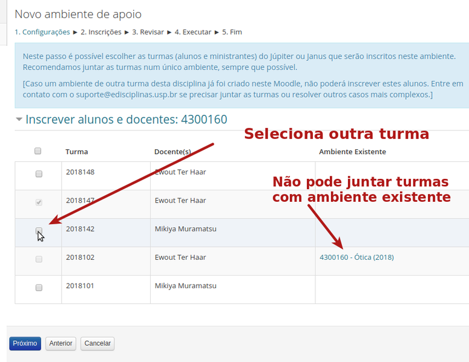
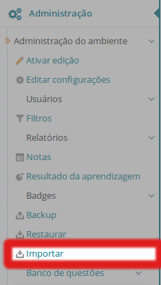
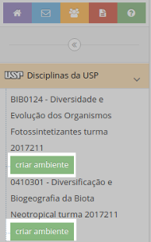
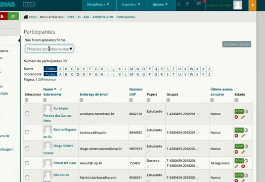

.. contents:: Conteúdo

Docentes
========

Criação de novos ambientes de apoio às disciplinas
--------------------------------------------------

O Moodle da USP oferece a possibilidade de criar "ambientes de apoio"
aos ministrantes de turmas cadastrados no Júpiter ou Janus.

A integração funciona assim: há uma *cópia* (atualizada diariamente, de
madrugada) das informações do Júpiter e do Janus. Caso conste que o
usuário logado é responsável (o Júpiter usa o termo "ministrante" )
por uma disciplina, o Moodle oferecerá a possibilidade de criar um
ambiente de apoio a esta turma e disciplina por meio de um link na
página principal, na barra lateral esquerda.

Para criar um ambiente no Moodle, procure o menu no lado esquerdo da
tela e o botão verde "Criar ambiente". O processo de criação é
simples:

    1. As configurações de algumas opções básicas, o título, nome
       curto (que aparece na barra de navegação) e o acesso ao
       material didático por parte de não-logados (veja abaixo);
    2. A inscrição dos matriculados no ambiente. Veja abaixo para a
       junção de turmas (recomendado se os ministrantes trabalham
       juntos).

**Atenção:** por padrão o **acesso de visitantes** é permitido.

  Isto significa que é permitido o acesso do conteúdo "estático"
  (arquivos e material didático) por todos os visitantes, incluindo
  mecanismos de busca como Google. Para restringir o acesso ao seu
  material somente aos alunos inscritos, escolha "Não" na hora de
  criar ambiente de apoio. Para ambientes existentes, veja como
  `configurar o acesso de visitantes`_ . Saiba que, mesmo abrindo o seu
  ambiente de apoio online, é possível também `restringir o acesso a um
  recurso em particular`_.

**Atenção: se o link "Criar ambiente" não aparecer:**

    1. Após **entrar pela primeira vez** no Moodle da USP, os links "criar
       ambiente" para a criação do ambiente, somente ficarão
       disponível no dia seguinte (estamos resolvendo esta limitação
       da nossa integração Júpiter ou Janus -> Moodle.)
    2. Há outras razões de não termos links "criar ambiente": pode não
       haver oferecimento de uma disciplina (segundo Júpiter ou
       Janus); o Setor de Graduação ou Pós da sua unidade ainda não
       atualizou as informações no Júpiter ou Janus; ou se nossa
       integração falhar por algum outro motivo. Em todos estes casos,
       podemos criar o curso manualmente, basta entrar em contato
       conosco (suporte@edisciplinas.usp.br). É preciso entrar (se
       logar) pelo menos uma vez no Moodle da USP para que seu usuário
       seja criado no sistema. É necessário o seu nome (o número USP
       também pode ser útil), e o código da disciplina no Júpiter ou
     `restringir o acesso a um
  recurso em particular`_ Janus, e eventualmente o código da turma (um código do tipo
       "2016201"). Podemos "juntar" mais do que uma turma no mesmo
       ambiente. ]

Agora que foi criado seu ambiente de apoio, veja `o material de
referência`_  para aprender a usá-lo.

Juntar Turmas
-------------

Recomendamos juntar as turmas se houver mais que uma por
disciplina. Neste caso, seus colegas ministrantes serão inscritos
também no ambiente que está criando. Se preferir trabalhar
independentemente, é também é possível ter um ambiente por turma,
deixando tudo no modo padrão.

Durante o processo de criação do ambiente de apoio à disciplina é
possível juntar, num único ambiente no Moodle, várias turmas no
Júpiter. Comece criando o ambiente de uma das turmas e na segunda
tela, escolha as outras turmas. Se as outras turmas têm outros
ministrantes, esses serão inscritos também (`é possível inscrevê-los
manualmente`_ também se o colega ministrante não tinha conta no sistema
no momento de criação do ambiente).  Juntar mais turmas no ambiente
sendo criado

.. _`é possível inscrevê-los manualmente`: https://atp-moodle-docs.readthedocs.io/pt/latest/dicas.html#Inscrever_Docentes.2C_Monitores_e_Alunos_manualmente

Veja as `instruções detalhadas de como é o novo processo de criação de
ambientes de apoio e junção de turmas`_.

.. _`instruções detalhadas de como é o novo processo de criação de ambientes de apoio e junção de turmas`: https://atp.usp.br/moodle/melhorias-na-criacao-de-novos-ambientes-no-moodle-da-usp

Importar conteúdos de anos passados
-----------------------------------

No Moodle da USP, os ambientes de apoio dos anos passados são
**arquivados**. Os alunos, monitores e docentes continuam inscritos e
as interações no AVA se preservam. Não recomendamos desinscrever os
alunos dos ambientes correspondentes de oferecimentos
passados. Primeiro porque os alunos perderiam acesso aos recursos e
atividades, e depois, porque isso implicaria em perda de
rastreabilidade e o histórico das ações no AVA.

A nossa recomendação, portanto, é criar um novo ambiente para o
oferecimento do ano corrente (veja acima) e "importar" os recursos e
atividades de ambientes de oferecimentos passados. No Moodle isto é
bem fácil: procure, no novo ambiente, o link "Importar" no menu
"Administração". Escolha o ambiente de apoio apropriado e escolhe as
atividades, recursos ou menus laterais que queira importar para o
ambiente novo. Você somente poderá "importar" ambientes em que estava
inscrito como docente. Se precisar importar o conteúdo de um ambiente
que era de outra pessoa, entre em contato conosco
(suporte@edisciplinas.usp.br, de preferência, com os links do ambiente
antigo de o novo).

   Use "Importar" na caixa "Administração do ambiente" novo e vazio para 
   trazer conteúdo e atividades de outros anos.

Inscrição automática de alunos matriculados
-------------------------------------------

Os alunos matriculados no Júpiter ou Janus com conta no Moodle da USP,
serão inscritos na hora da criação do ambiente de apoio e os outros
matriculados, sem conta ainda, serão inscritos na medida que acessam o
Moodle.

É possível verificar no menu "Navegação" > "Participantes" ou no menu
"Administração" > "Usuários" > "Usuários" quantos alunos estão
atualmente inscritos no seu ambiente.

Inscrição manual de alunos
::::::::::::::::::::::::::

É possível inscrever alunos manualmente, caso o procedimento
automático descrito acima não funcione por algum motivo. Para
inscrever alunos no seu curso, vá no menu "Administração" > "Usuários"
> "Usuários inscritos" e em "Inscrever Usuários". Procure pelo número
USP, o início do e-mail ou pelo nome. Os alunos têm que ter acessado o
Moodle da USP pelo menos uma vez. Veja também `Docentes, Monitores e
Alunos Manualmente`_.

.. _`Docentes, Monitores e Alunos Manualmente`: https://atp-moodle-docs.readthedocs.io/pt/latest/dicas.html#Inscrever_Docentes.2C_Monitores_e_Alunos_manualmente
.. _`configurar o acesso de visitantes`:  https://atp-moodle-docs.readthedocs.io/pt/latest/docentes.html#configurar-acesso-de-visitantes
.. _`restringir o acesso a um recurso em particular`: https://atp-moodle-docs.readthedocs.io/pt/latest/docentes.html#configurar-acesso-de-visitantes

Configurar acesso de visitantes
-------------------------------

	    
  Clicando em "Métodos de inscrição" > "Acesso como visitante",
  determine se não-logados podem ver os arquivos e os outros recursos
  estáticos do seu ambiente de apoio.

Normalmente, os cursos do Moodle da USP estão "abertos" de modo que
visitantes (qualquer usuário da Internet, incluindo os mecanismos de
busca como o Google) podem acessar o material disponibilizado. Porém,
mesmo aberto, todas as contribuições de alunos, tais como discussões
no fórum ou envios de arquivo, permaneçam sendo acessível somente para
os inscritos no ambiente de apoio.

Caso queira que ninguém (além dos matriculados da sua disciplina) veja
os recursos, conteúdos e materiais didáticos disponibilizados, é
possível fechar o seu ambiente. Acesse seu curso e procure no menu
"Administração" o link Usuários > Métodos de Inscrição > Acesso como
visitante (veja ao lado).

Monitores
---------

No Moodle, é possível alguém ter um determinado "papel" com certas
permissões no contexto de um determinado curso. Criamos um papel
especialmente para monitores, no sentido que são usados na USP.

Para cadastrar Monitores no seu curso, vá no menu "Administração", clique em "Designar Funções" > "Monitor" e na tela seguinte use a
função busca para achar o usuário em questão. Veja também `Inscrever
Docentes, Monitores e Alunos Manualmente`_.

.. _`Inscrever Docentes, Monitores e Alunos Manualmente`: https://atp-moodle-docs.readthedocs.io/pt/latest/dicas.html#Inscrever_Docentes.2C_Monitores_e_Alunos_manualmente

Docentes de cursos podem escolher qualquer usuário do Moodle para ser
Monitor no seu curso. Por enquanto, o papel de "Monitor" possui quase
as mesmas permissões que o papel "Docente" (pode editar o ambiente,
avaliar atividades dos alunos, etc.)

Editar o Ambiente
-----------------

O próximo passo é ir para o seu recém-criado curso e clicar no botão
"Editar". Agora é possível colocar recursos e atividade nas seções
(semanas, tópicos ou abas, conforme a escolha para o formato de curso
nas configurações do curso). Veja mais algumas funções em
Ajuda:Moodle/Dicas para começar. Para quem quiser se aprofundar,
recomendamos o seguinte material de Referência:

    * A `documentação oficial`_ do Moodle, para ministrantes, administradores, etc. Para docentes e monitores recomendamos o o `FAQ`_ e a página `Managing a Moodle Course`_
    * De seis em seis meses é oferecido um "MOOC" sobre como usar Moodle: veja https://learn.moodle.net/ e participe gratuitamente (em inglês).
    * O Arquivio: `MoodleToolGuideforTeachers Shared May2010 ptbr <../_files/MoodleToolGuideforTeachers_Shared_May2010_ptbr>`_ é um guia visual que associa processos pedagógicos com ferramentas do Moodle
    * Existem vários `tutoriais`_ interessantes na rede.
    * É possível testar funcionalidades do Moodle no `site de demonstração do próprio Moodle`_
    * Procure `cursos disponibilizados por outras instituições`_ 

Acesso a mais funcionalidades
-----------------------------

Algumas das atividades mais complexas ou especializadas, comumente,
ficam ocultas para docentes ou monitores. Para ter acesso a atividades
como o Laboratório de Programação (VPL) ou acessar a `gestão mais
avançada dos inscritos`_, é possível mudar o próprio papel para "Docente
Avançado". Dentro de seu ambiente:

    - Clique em "Usuários" > "Usuários inscritos";
    - Busque por seu nome ou número USP;
    - Na coluna "Papéis", clique na caneta cinza e no filtro;
    - Comece a digitar "av...";
    - Escolha "Docente Avançado";
    - Salve. 

.. _`o material de referência`: https://atp-moodle-docs.readthedocs.io/pt/latest/dicas.html
.. _`documentação oficial`: https://atp-moodle-docs.readthedocs.io/pt/latest/dicas.html
.. _`gestão mais avançada dos inscritos`: https://atp-moodle-docs.readthedocs.io/pt/latest/dicas.html#Gerir_alunos_inscritos
.. _`FAQ`: http://docs.moodle.org/en/Teacher_documentation
.. _`Managing a Moodle Course`: http://docs.moodle.org/en/Managing_a_Moodle_course
.. _`tutoriais`: http://www.google.com.br/search?q=tutorial+moodle
.. _`site de demonstração do próprio Moodle`: http://hub.moodle.org/
.. _`cursos disponibilizados por outras instituições`: http://hub.moodle.org/

