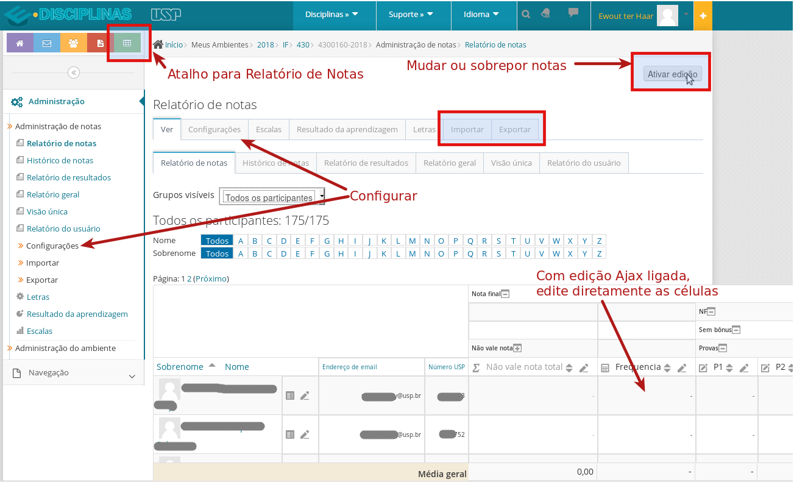
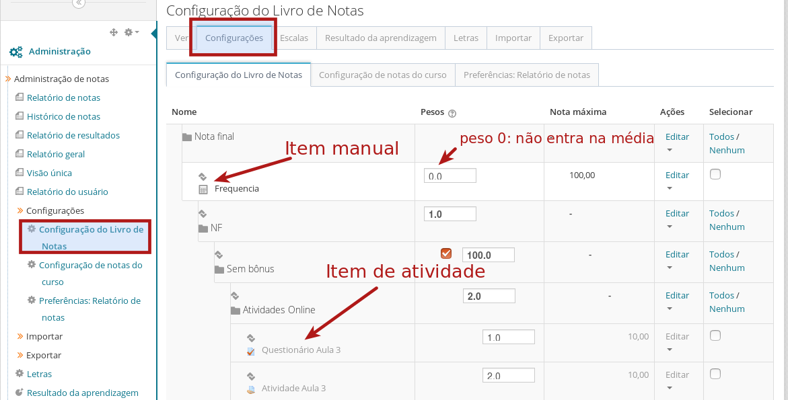
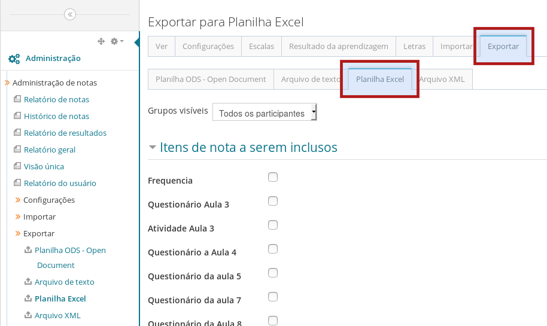
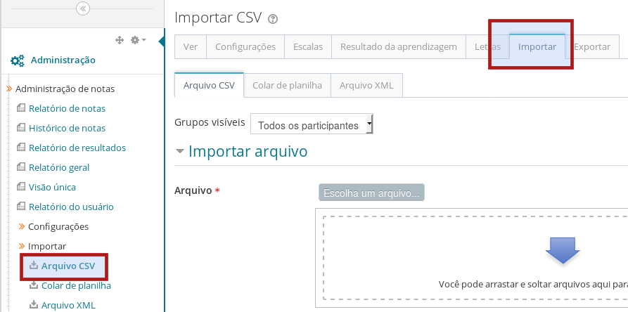

Quadro de Notas
=============================================

O `Quadro de Notas`_ do Moodle é o meio principal de comunicar os resultados e notas aos alunos inscritos no ambiente. O QN consiste de "Itens de Nota" que ficam em "Categorias de Notas". Um item de nota corresponde a uma coluna no quadro de nota e os alunos a uma linha, parecido com uma planilha em Excel. 

Há três maneiras que uma nota chega no quadro de notas: 

**Automaticamente**
    Por meio de uma ligação entre atividades no ambiente (questionários, tarefas, etc.) e o quadro de notas. Se uma nota é dado na atividade (automaticamente se for um questionário do tipo teste ou manualmente se for uma questão ou tarefa dissertativa), esta nota será "transportada" automaticamente para o quadro de notas. 
**Manualmente**
    Neste caso, o docente ou monitor vai no quadro de notas e preenche as notas manualmente. 
**Importação**
    Uma ou mais colunas do QN podem ser mantidos fora do Moodle (numa planilha Excel ou Planilha Google) e importado para divulgação no QN do Moodle. 

É possível mudar notas que chegaram "automaticamente" a partir de atividades diretamente no QN. Na terminologia de Moodle isto é chamado de "sobrepor" notas. Se uma nota é sobreposta, a ligação entre a atividade e o quadro de nota é rompida (mas pode ser re-estabelecida) no sentido que atualizações da nota na atividade não serão mais refletidas no quadro de notas.

Veja a seguir algumas dicas. 

.. contents:: Conteúdo

O Quadro de Notas
-----------------

Para configurar seu QN, clique no link "Configuração do Livro de Notas" na caixa de Administração do seu ambiente. Para ver as notas, procure a aba "Ver" ou o link "Relatório de notas". O resultado será parecido com a imagem abaixo. Os alunos ficam nas linhas do quadro e os itens de nota nas colunas. Cada coluna corresponde a uma atividade avaliada no ambiente (questionários, envio de tarefa etc.) ou itens de nota manuais.

Repare em particular o botão "Ativar Edição". Para editar itens de nota manuais (notas que não correspondem a nenhuma atividade), clique em "Ativar edição". É possível "sobrepor" notas (mudá-las manualmente no quadro de notas) independente do valor na atividade. Uma nota sobreposta é indicada com outra cor de fundo.

Dica: para editar as células diretamente, procure em Configurações / Preferências a opção "Habilitar AJAX". 

Organizar e Configurar o Quadro Notas
-------------------------------------

Para organizar e configurar o quadro de notas clique na aba "Cconfigurações" (se estiver na página inicial do seu ambiente, clique em Administração / Configurar livro de notas"). Cada item de nota pode ser configurado (peso, nota máxima, etc.) diretamente nesta página ou abrindo o menu "editar" do item. 

Itens de notas podem ser organizados em Categorias. Um caso de uso comum é ter uma categoria para as notas das provas. Uma vez criada, pode mover itens de nota para dentro da categoria ou criar itens de nota manuais dentro dela. Para criar uma coluna no quadro de notas para os resultados de uma prova presencial, clique em "Adicionar item de nota". 

Exportar notas para uma planilha
--------------------------------

Veja também a `documentação de referência do Moodle`_.

É possível exportar o quadro de notas para uma planilha e guardar uma cópia na sua própria máquina. Isso é útil para pelo menos dois motivos:

    1. Ter uma cópia e backup das notas na sua máquina
    2. Usar a planilha exportada para importar notas no Júpiter 

A exportação do quadro de notas também é o primeiro passo para conseguir uma planilha para importar notas no quadro de notas (de uma prova aplicada em sala de aula, por exemplo).

No quadro de notas, escolhe a aba "Exportar" e o item do sub-menu "Excel": 

Escolhe os itens de nota (ou de-selecione todos os itens) que queira baixar. Clique "Download" para baixar a planilha para seu computador. 

Importar notas de uma planilha
------------------------------

Veja também `a documentação de referência do Moodle`_.

É fácil usar o quadro de notas do Moodle para divulgar notas geradas fora do sistema (a vantagem é que os alunos só terão acesso a sua própria nota).

Primeiro, organize uma planilha com pelo menos uma coluna com o número USP e uma ou mais notas (veja acima como conseguir uma planilha com os números USP dos alunos inscritos no ambiente). É uma boa prática de tirar desta planilha todas as colunas desnecessários (nome e outras notas) para evitar o risco de importar notas erradas. As únicas colunas que necessariamente devem constar na planilha de importação são a coluna com o número USP e as colunas com as novas notas. Agora exporte a planilha para CSV (separada por vírgulas). No Quadro de Notas / Importar escolhe "Arquivo CSV" e sobe o arquivo:

Agora deve indicar para Moodle qual é a coluna na sua planilha que corresponde a um número USP (Identificar Usuário) e qual coluna na planilha vai corresponder a qual item de nota ("Mapeamento de itens de nota). Clique em Enviar notas para finalizar o processo. 

`Veja aqui para uma outra explicação do processo de importação`_.

.. _`Quadro de Notas`: https://docs.moodle.org/en/Grading_quick_guide
.. _`documentação de referência do Moodle`: http://docs.moodle.org/en/Grade_export
.. _`a documentação de referência do Moodle`: http://docs.moodle.org/en/Grade_import
.. _`Veja aqui para uma outra explicação do processo de importação`: http://atp.usp.br/moodle/importando-notas-a-partir-de-um-csv-no-moodle/
